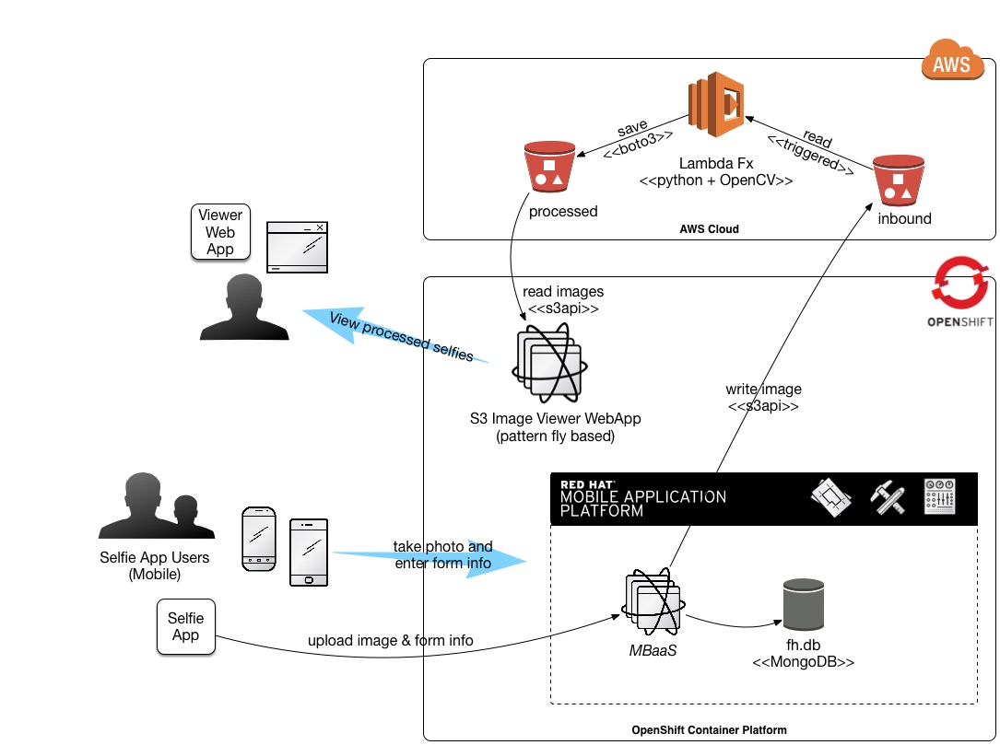

# Selfie Funhouse - Mobile

Here is the bigger picture of what this fits into:



## About the code
It's node.js - and it REQUIRES Red Hat's Mobile Application Platform or FeedHenry

## How to use this service
* Create a form using Drag and Drop in RHMAP
* Add a photo field as the 1st field in the form (the rest can be whatever you want)
* Create a forms project and add the form to it
* Edit the default cloud service in RHMAP
  * Add this file to the `lib` folder
  * Add ```require('./lib/handleforms');``` to your `application.js`
  * Change source code so the S3 bucket name to matches your bucket (or set the service's ENV VAR)
* Deploy everything and run

** NOTE: for the full system you will also have to stand up AWS S3 to accept the outbound photos, the lambda service, and the pattern fly website
